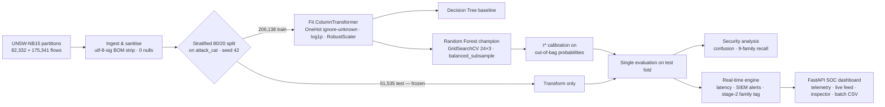
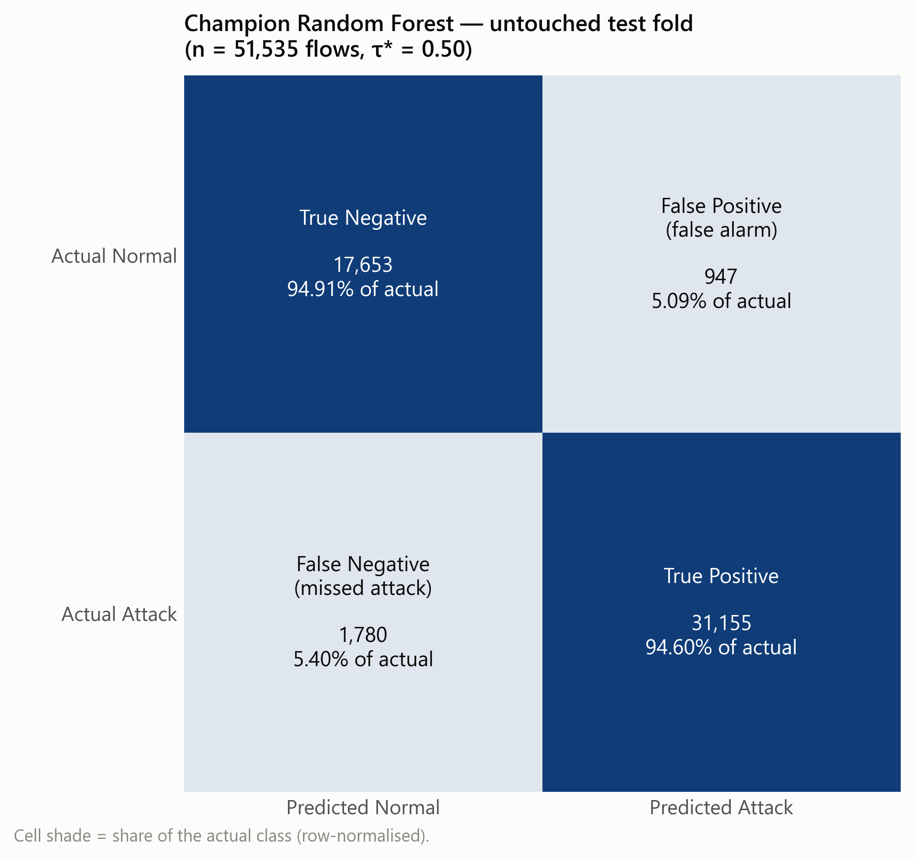
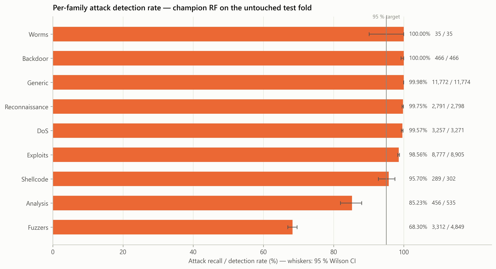
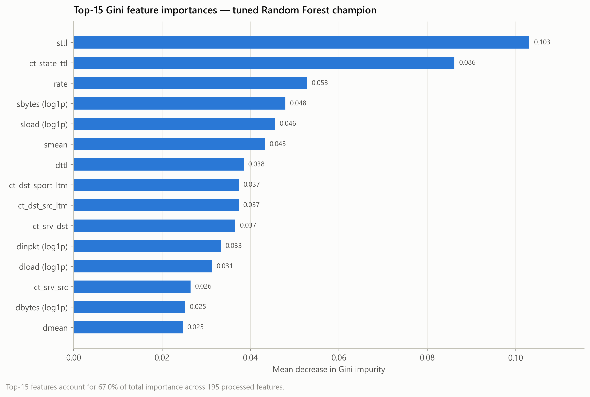
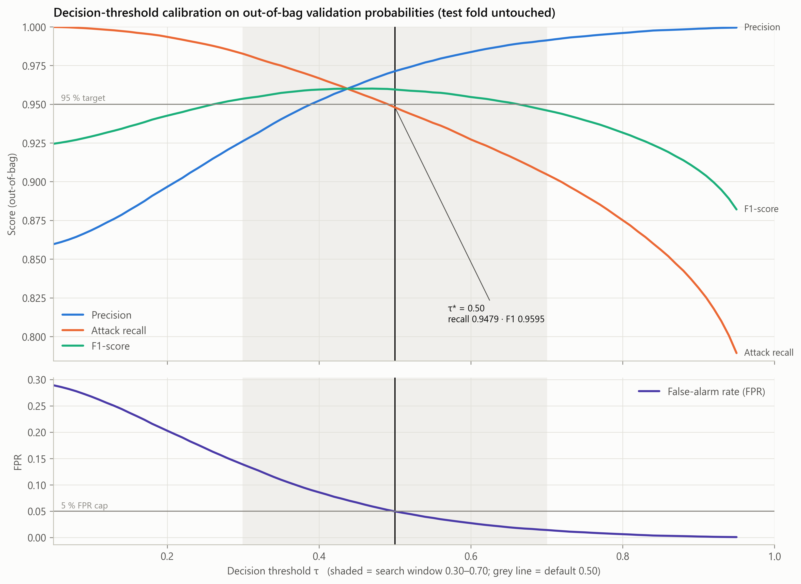
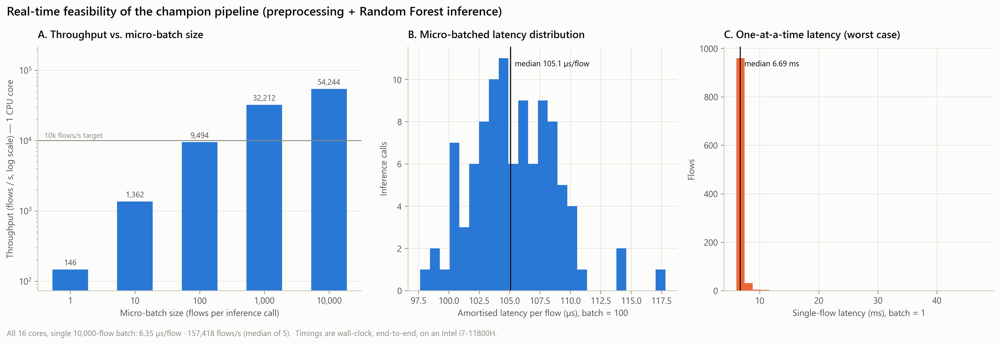
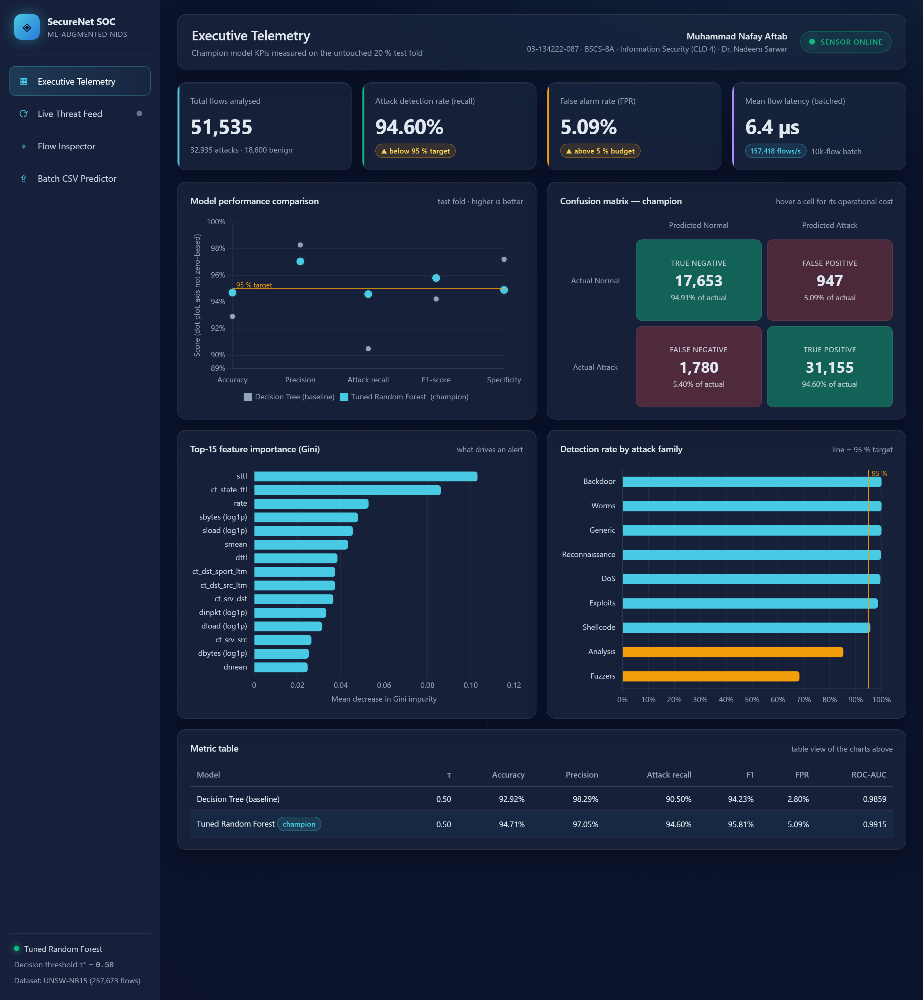
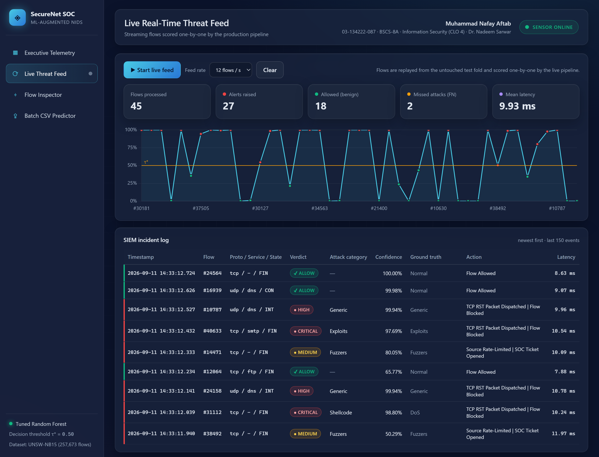
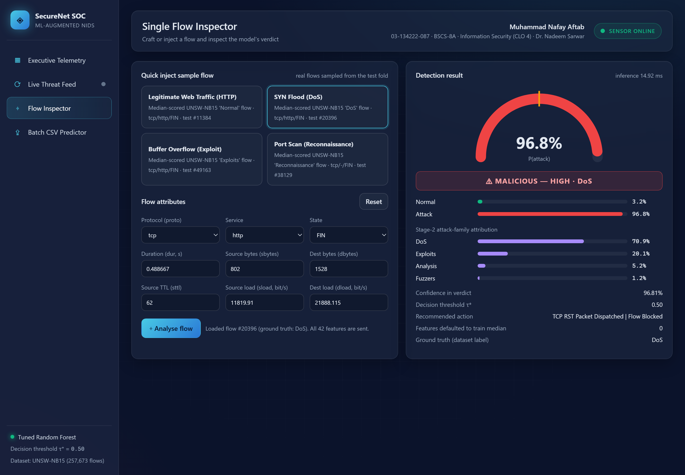
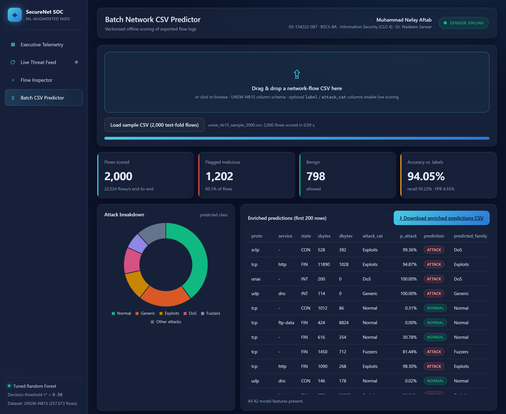

<div align="center">

# 🛡️ CLO4-IDS-ML-Solution
### AI-Powered Network Intrusion Detection with Real-Time Threat Detection


**Information Security · CLO 4** — *Create solutions to real-life scenarios using security-related tools*

| Student | Enrolment | Class | Instructor |
|---|---|---|---|
| **Muhammad Nafay Aftab** | 03-134222-087 | BSCS-8A | Dr. Nadeem Sarwar |

</div>

---

## 1. Objective — the CISO mandate

SecureNet Corp.'s CISO asked for a proof-of-concept that **augments the existing signature-based NIDS with
machine learning**. The PoC has four requirements:

- classify every network flow as **Normal** or **Malicious**
- sustain **real-time** throughput
- explain its alerts to SOC analysts
- be honest about the attacks it misses

This repository contains the complete, reproducible solution:

- a leak-free preprocessing pipeline
- a tuned Random Forest champion, benchmarked against a Decision-Tree baseline
- security-centric evaluation, including recall for each of the 9 attack families
- a latency benchmark and a streaming SIEM alert engine
- a single-command **SOC web dashboard**
- a fully executed notebook and the MS Word report

## 2. Headline results (untouched 20 % test fold — 51,535 flows)

| Model | τ | Accuracy | Precision | **Attack recall** | F1 | **False-alarm rate** | ROC-AUC |
|---|---:|---:|---:|---:|---:|---:|---:|
| Decision Tree (baseline) | 0.50 | 92.92 % | 98.29 % | 90.50 % | 94.23 % | 2.80 % | 0.9859 |
| **Tuned Random Forest (champion)** | **0.50** | **94.71 %** | **97.05 %** | **94.60 %** | **95.81 %** | **5.09 %** | **0.9915** |

> **Transparency note: the ≥ 95 % target.** The project brief set a ≥ 95 % gate on accuracy, recall and F1,
> with FPR < 5 %. The champion **clears F1 (95.81 %) but falls 0.3–0.4 pp short on accuracy and recall, and
> exceeds the FPR budget by 0.09 pp.**
>
> A validation-only experiment ([`experiments/model_selection_validation.py`](experiments/model_selection_validation.py),
> results in [`artifacts/model_selection_validation.txt`](artifacts/model_selection_validation.txt)) tested an
> alternative tree ensemble (ExtraTrees) and five engineered ratio features against the tuned forest. None lifted
> recall above **≈ 94.3 % under FPR < 5 %**, and exact-duplicate label conflicts explain only 0.26 % of errors.
> The evidence points to overlap in the data (Normal ↔ Fuzzers) rather than a tuning gap.
>
> The numbers above are reported exactly as measured, and the test fold was never used for tuning.

**What the champion delivers**

- It recovers **1,350 more attacks than the baseline**, cutting false negatives by 43 %.
- It runs at **6.35 µs/flow ≈ 157,000 flows/s** when batched on a laptop CPU.

## 3. Architecture



## 4. Repository layout

```text
CLO4-IDS-ML-Solution/
├── dataset/            UNSW-NB15 partitions + setup instructions (raw 590 MB dumps git-ignored)
├── notebooks/          CLO4_IDS_ML_Solution.ipynb — self-contained, fully executed, 13 sections
├── src/
│   ├── config.py       paths, seed, frozen feature lists, student metadata
│   ├── data.py         ingestion, BOM sanitisation, stratified split
│   ├── pipeline.py     leak-free ColumnTransformer
│   ├── eda.py          4 EDA proofs            ├── baseline.py      Decision Tree
│   ├── champion.py     RF tuning + τ* calib.   ├── security_eval.py confusion + family recall
│   ├── realtime.py     latency + SIEM engine   ├── app.py           FastAPI dashboard backend
│   ├── web/            index.html · styles.css · app.js (zero-npm front-end)
│   ├── build_notebook.py · generate_report.py · capture_dashboard.py · validate_*.py
├── experiments/        validation-only model-selection & error-ceiling studies
├── artifacts/          every metric as JSON/CSV + run logs (the source of all reported numbers)
├── figures/            300-DPI figures + dashboard screenshots
├── reports/            Project_Report_CLO4.docx
└── phase_execution_log.md   phase-by-phase evidence, commit hashes, decisions
```

## 5. Dataset setup

The two official UNSW-NB15 partitions (`UNSW_NB15_training-set.csv`, `UNSW_NB15_testing-set.csv`, 47 MB in total)
are **committed**, so the project runs straight after cloning. See [`dataset/README.md`](dataset/README.md) for
the official source ([UNSW Canberra](https://research.unsw.edu.au/projects/unsw-nb15-dataset)).

## 6. How to run

```bash
git clone https://github.com/Nafay-Aftab/CLO4-IDS-ML-Solution.git
cd CLO4-IDS-ML-Solution
python -m venv .venv
.venv\Scripts\activate            # Windows  (macOS/Linux: source .venv/bin/activate)
pip install -r requirements.txt
```

| Step | Command | Output |
|---|---|---|
| Verify environment | `python -m src.validate_env` | dependency + dataset check |
| EDA proofs | `python -m src.eda` | `figures/eda_*.png` |
| Baseline | `python -m src.baseline` | `artifacts/metrics_baseline.json` |
| **Train champion** (≈ 3 min) | `python -m src.champion` | `models/champion_bundle.joblib`, metrics, figures |
| Security evaluation | `python -m src.security_eval` | confusion matrix, family recall |
| Real-time benchmark + SIEM | `python -m src.realtime` | latency figure, `artifacts/siem_alert_log.txt` |
| **SOC dashboard** | `python -m src.app` → <http://localhost:8000> | 4 interactive views |
| Notebook | `jupyter notebook notebooks/CLO4_IDS_ML_Solution.ipynb` | full end-to-end walkthrough |
| Word report | `python -m src.generate_report` | `reports/Project_Report_CLO4.docx` |

> Models (`models/*.joblib`) are git-ignored because of their size. Run `python -m src.champion` and then
> `python -m src.realtime` once before launching the dashboard.

## 7. Security analysis — which attacks slip through?

| Family | Test flows | Recall | Missed | Share of all misses |
|---|---:|---:|---:|---:|
| Backdoor | 466 | **100.00 %** | 0 | 0.0 % |
| Worms | 35 | **100.00 %** | 0 | 0.0 % |
| Generic | 11,774 | 99.98 % | 2 | 0.1 % |
| Reconnaissance | 2,798 | 99.75 % | 7 | 0.4 % |
| DoS | 3,271 | 99.57 % | 14 | 0.8 % |
| Exploits | 8,905 | 98.56 % | 128 | 7.2 % |
| Shellcode | 302 | 95.70 % | 13 | 0.7 % |
| Analysis | 535 | 85.23 % | 79 | 4.4 % |
| **Fuzzers** | 4,849 | **68.30 %** | **1,537** | **86.4 %** |

- **Fuzzers are the blind spot.** They account for **86 % of all missed attacks**. Many fuzzing sessions are
  short, low-volume exchanges that are statistically indistinguishable from benign clients. In fact, the only
  exact feature-vector collisions between classes in the entire dataset are Normal ↔ Fuzzers.
  - **Implication:** a zero-day hunt against an exposed service would largely go unseen until the exploitation
    stage.
- **Rare ≠ undetected.** Worms (35/35) and Backdoor (466/466) are fully detected thanks to their distinctive TTL
  and state fingerprints.

<p align="center">
   
</p>

## 8. Explainability & real-time performance

<p align="center">
   
</p>

**What drives an alert.**

- **TTL fingerprints** (`sttl`, `ct_state_ttl`) are the strongest signals.
- **Rate and byte volumes** (`rate`, `sbytes`, `sload`, `smean`) come next.
- **Connection fan-out** (`ct_dst_sport_ltm`, `ct_srv_dst`) captures scanning behaviour.

**τ\* = 0.50** is the lowest threshold at which the out-of-bag FPR stays under 5 %.



| Mode | Latency / flow | Throughput |
|---|---:|---:|
| 10,000-flow batch, all 16 cores | **6.35 µs** | **157,418 flows/s** |
| micro-batch 1,000, 1 core | 31.0 µs | 32,212 flows/s |
| one flow at a time, 1 core | 6.83 ms | 146 flows/s |

Flow exporters (NetFlow/IPFIX/Zeek) deliver records in batches, so the micro-batched figures are the ones that
apply in deployment. Strict one-flow-at-a-time scoring would need a compiled forest (Treelite/ONNX).

## 9. SOC web dashboard — `python -m src.app`

FastAPI plus a bespoke glassmorphic HTML5/CSS3/Chart.js front-end, with **no Node.js or npm**. All telemetry is
computed live at start-up by scoring the test fold with the serialized champion.

| Executive telemetry | Live threat feed |
|---|---|
|  |  |
| **Single-flow inspector** | **Batch CSV predictor** |
|  |  |

REST API: `GET /api/telemetry` · `GET /api/presets` · `POST /api/predict/single` · `POST /api/predict/batch` ·
`GET /api/predict/batch/{token}` · `GET /api/stream/simulated` (SSE) · `GET /api/sample.csv`.
The endpoints are validated by `python -m src.validate_dashboard`.

### Sample streaming SIEM alerts

```text
[2026-09-11 13:21:04.659] [ALERT] [CRITICAL] Malicious Flow #50231 Detected!  (tcp/http/FIN)
  ├─ Attack Category : Exploits   (stage-2 guess: match; ground truth: Exploits)
  ├─ Detection       : TP
  ├─ Confidence Score: 99.99%   (τ* = 0.50)
  ├─ Latency         : 9,823.80 microseconds
  └─ Action Taken    : TCP RST Packet Dispatched | Flow Blocked
[2026-09-11 13:21:04.969] [ALERT] [MEDIUM] Malicious Flow #9225 Detected!  (udp/-/INT)
  ├─ Attack Category : Fuzzers   (stage-2 guess: match; ground truth: Fuzzers)
  ├─ Detection       : TP
  ├─ Confidence Score: 76.74%   (τ* = 0.50)
  ├─ Latency         : 9,927.70 microseconds
  └─ Action Taken    : Source Rate-Limited | SOC Ticket Opened
```

The full log is in [`artifacts/siem_alert_log.txt`](artifacts/siem_alert_log.txt). The stage-2 family tag is
only indicative: test accuracy is 75.3 %, and DoS, Analysis and Backdoor share near-identical flow statistics.

## 10. References

1. N. Moustafa, J. Slay, "UNSW-NB15: A comprehensive data set for network intrusion detection systems," *MilCIS*, 2015.
2. L. Breiman, "Random forests," *Machine Learning*, 45(1), 2001.
3. F. Pedregosa et al., "Scikit-learn: Machine learning in Python," *JMLR*, 12, 2011.
4. R. Sommer, V. Paxson, "Outside the closed world: On using machine learning for network intrusion detection," *IEEE S&P*, 2010.

---
<sub>Every number in this README is taken from `artifacts/` and was produced by the code in this repository. Phase-by-phase evidence and commit hashes are in [`phase_execution_log.md`](phase_execution_log.md).</sub>
